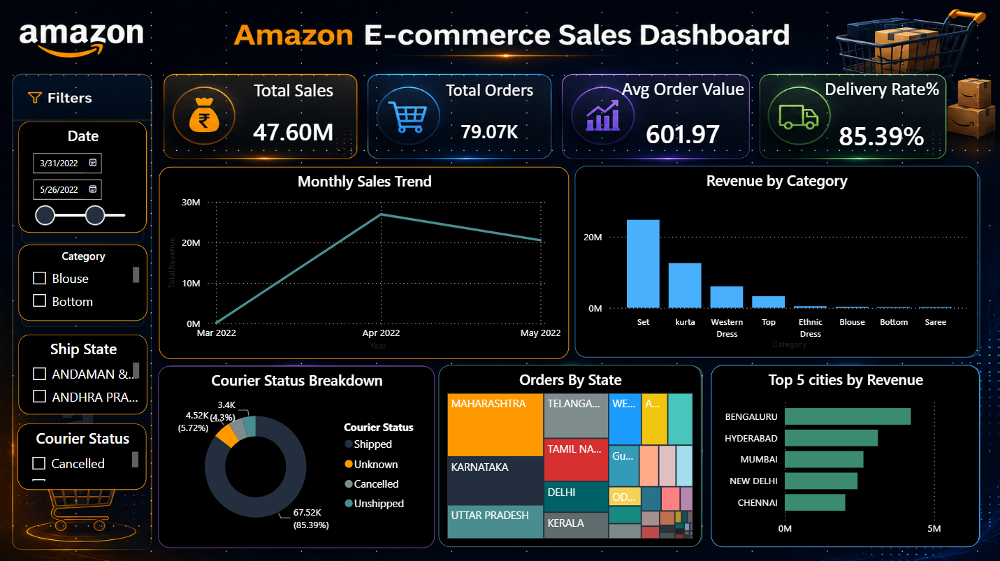

## Amazon E-Commerce Sales Dashboard

Analysed 1.29 lakh+ real Amazon order records to uncover
sales trends, top categories, and delivery performance
using Excel and Power BI.

### Tools used
- Excel — data cleaning, pivot tables
- Power BI — interactive dashboard

### Dataset
Amazon Sale Report (Kaggle) — 1,29,000+ rows, Apr-Jun 2022

### Key insights
📈 Total revenue reached ₹47.6 Million from 79K+ orders.
🛍️ Set and Kurta categories contributed the highest sales revenue.
🚚 Delivery success rate was 85.39%, indicating strong fulfillment performance.
📅 Sales peaked in April 2022, showing the highest monthly revenue.
🏙️ Bengaluru, Hyderabad, and Mumbai were the top revenue-generating cities.
📍 Maharashtra, Karnataka, and Uttar Pradesh generated the highest number of orders.
⚠️ Around 14.6% of orders were cancelled, unshipped, or had unknown status, highlighting an area for operational improvement.
💰 Average Order Value (AOV) was ₹601.97, indicating consistent customer spending patterns.

### Dashboard preview

### Files in this repo
- amazon_sales_clean.xlsx — cleaned dataset
- amazon_ecommerce_dashboard.pbix — Power BI file
- amazon_ecommerce_dashboard.pdf — dashboard export
- dashboard_screenshot.png — preview image
